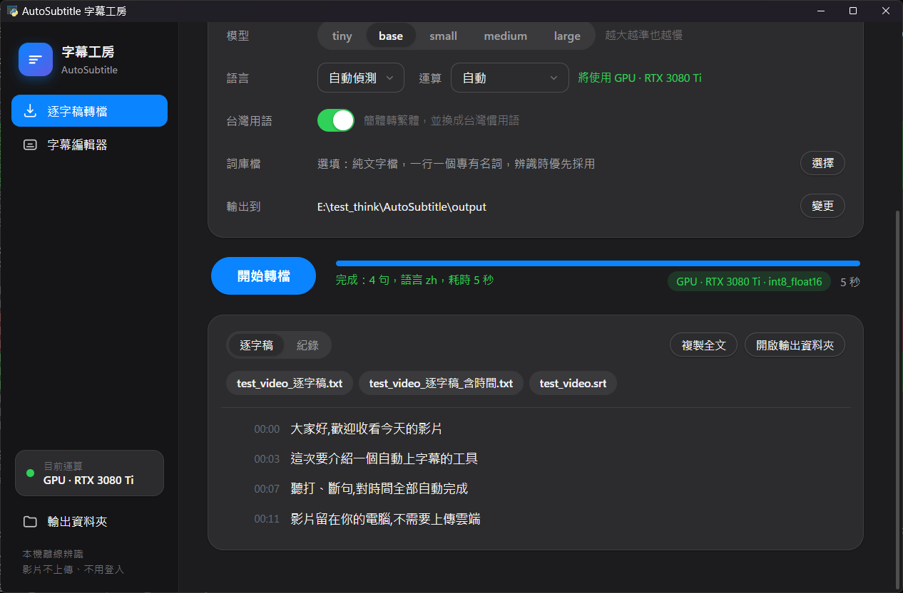
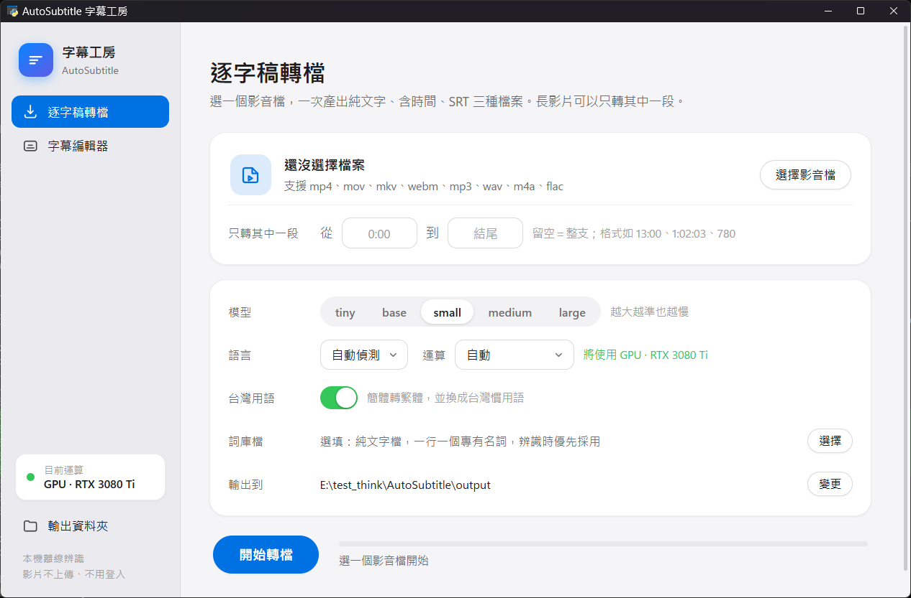
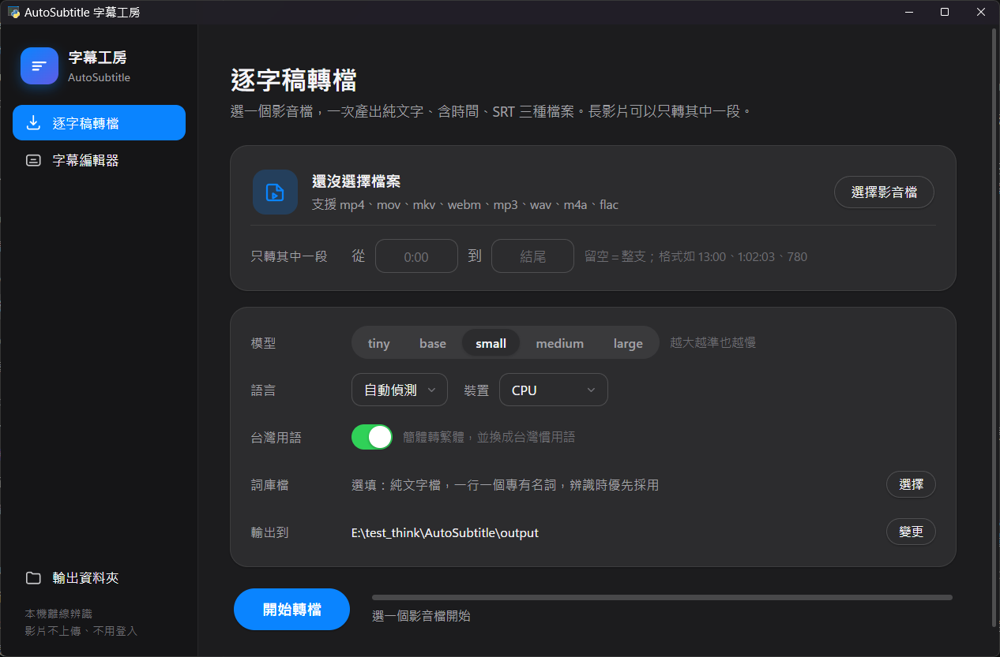
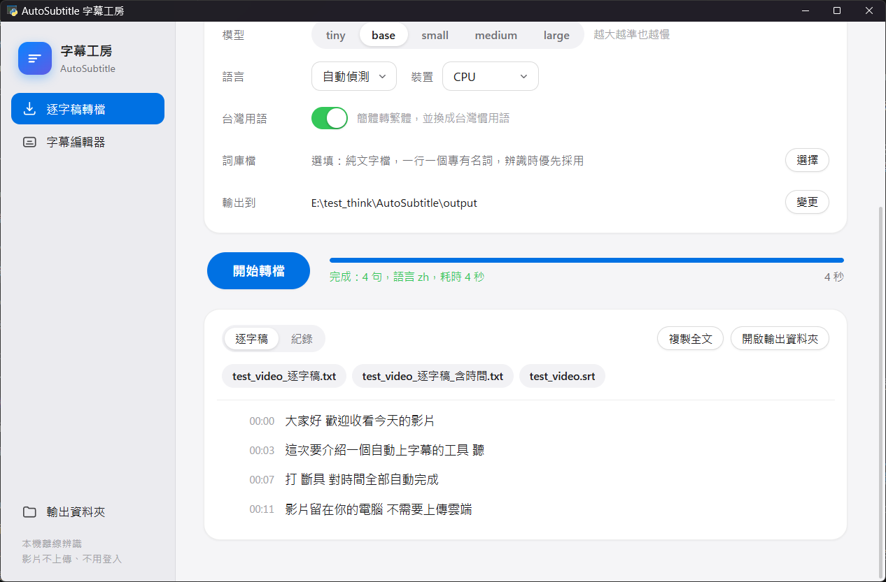
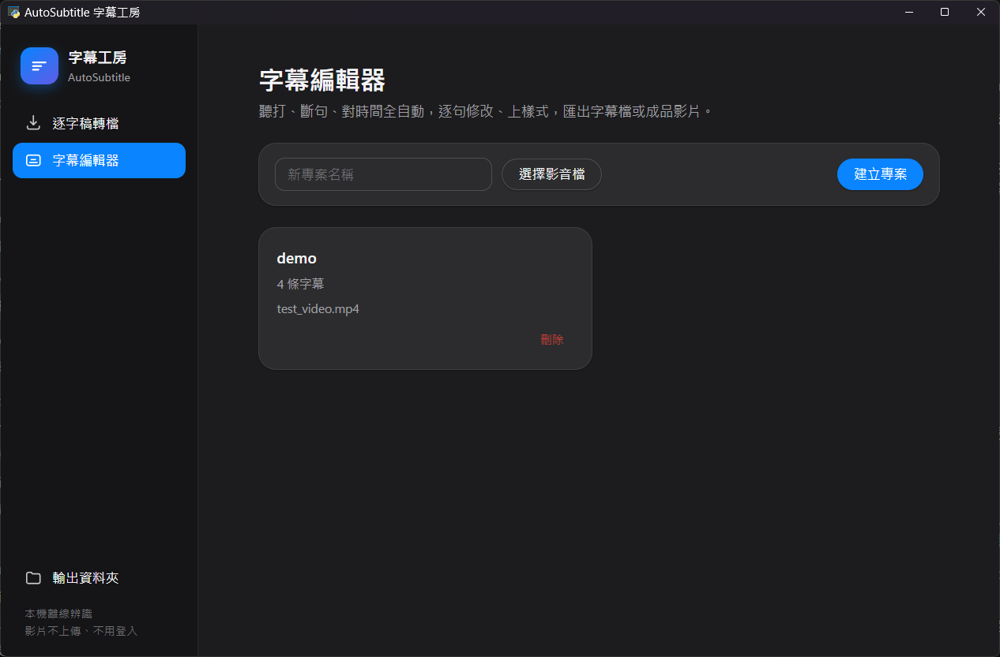
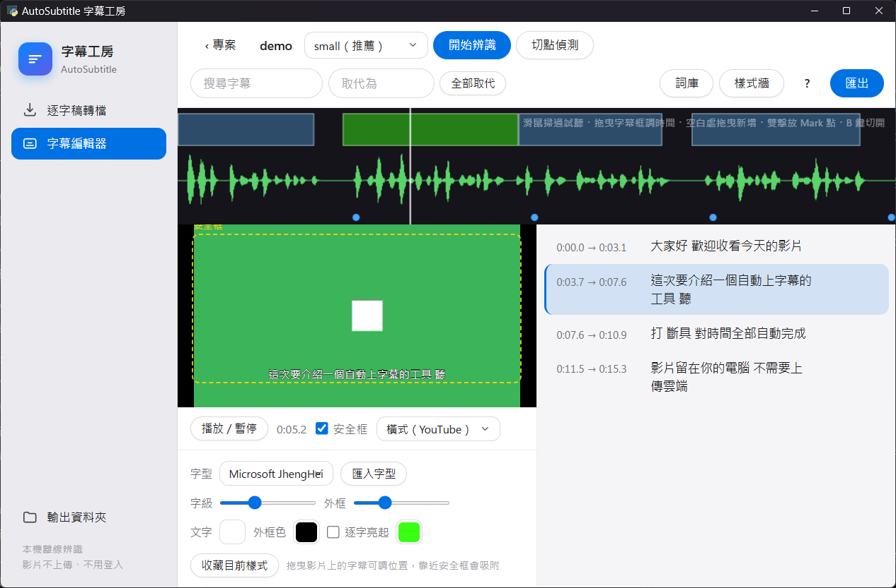
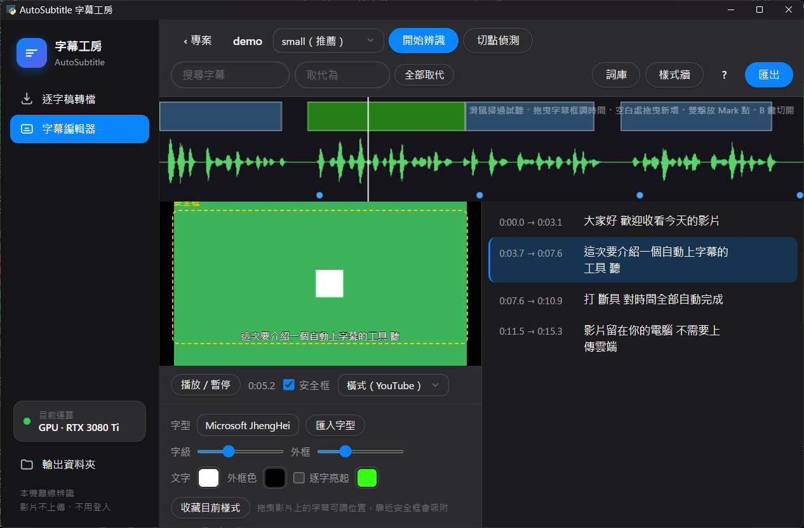
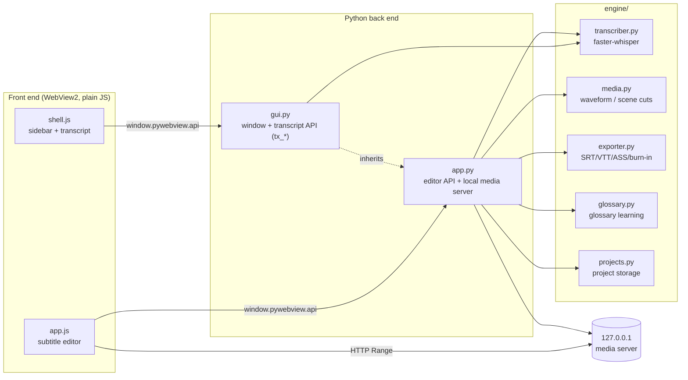
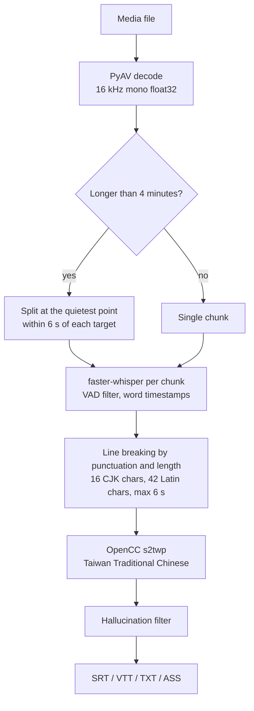

# AutoSubtitle

[繁體中文](README.md) | **English**

A desktop tool that transcribes, segments, times, styles, and exports subtitles entirely on your own computer.
Speech recognition runs offline. Your videos are never uploaded, and no account is needed.



## Features

- **One window.** A sidebar switches between Transcript and Subtitle Editor. Nothing opens a second window.
- **Rounded, minimal UI.** Pill buttons, rounded cards, segmented controls, and switches. It follows the system light or dark theme.
- **Offline speech recognition.** Built on faster-whisper, a CTranslate2 port of Whisper, with automatic detection of 99 languages.
- **Uses the GPU automatically.** With an NVIDIA card it runs on the GPU, and the sidebar always shows whether the GPU or CPU is in use. A 67-minute meeting took about 2.5 minutes with the medium model on an RTX 3080 Ti.
- **Handles long videos.** Audio is split at quiet points so memory use stays flat. If memory runs out, the model steps down a size instead of failing.
- **Taiwan Traditional Chinese.** OpenCC `s2twp` converts Simplified Chinese to Traditional Chinese with Taiwanese vocabulary.
- **A glossary that learns.** When you correct a subtitle, the app finds what changed and offers to add it to the glossary, which biases the next run.
- **Full editor.** Waveform timing, scene-cut snapping, live video preview, subtitle styles, karaoke word highlighting, and safe-area guides.
- **Export.** SRT, VTT, TXT, and styled ASS. With ffmpeg installed it can also burn subtitles into the video.

## Screenshots

| Transcript (light) | Transcript (dark) |
|---|---|
|  |  |
| **Finished (light)** | **Project list (dark)** |
|  |  |
| **Subtitle editor (light)** | **Subtitle editor (dark)** |
|  |  |

All screenshots come from the running app. The transcript is a real result from the `base` model on the bundled test video. The interface text is in Traditional Chinese.

## Download

No Python needed. Grab the file for your system from the **[Releases page](https://github.com/alextixu/AutoSubtitle/releases/latest)**:

| System | File |
|---|---|
| Windows 10/11 | `AutoSubtitle-<version>-Windows.zip` |
| Windows + NVIDIA GPU | `AutoSubtitle-<version>-Windows-NVIDIA-GPU.zip`, which bundles the CUDA libraries. It is larger but much faster |
| Mac (M1, M2, M3, M4…) | `AutoSubtitle-<version>-macOS-Apple-Silicon.dmg` |
| Mac (Intel) | `AutoSubtitle-<version>-macOS-Intel.dmg` |

- **Windows.** Extract the zip and open `AutoSubtitle.exe`. If SmartScreen appears, choose **More info**, then **Run anyway**.
- **macOS.** Open the dmg and drag AutoSubtitle into Applications. If macOS says it can't verify the developer, go to **System Settings → Privacy & Security** and choose **Open Anyway**.
- The app isn't code-signed, so each system warns you once. After that it opens normally.
- The first use of each model downloads it once, which needs internet. After that it works offline.

Where the downloaded app keeps its data:

| What | Windows | macOS |
|---|---|---|
| Transcripts | `Documents\AutoSubtitle` | `~/Documents/AutoSubtitle` |
| Projects, glossary, styles, log | `%APPDATA%\AutoSubtitle` | `~/Library/Application Support/AutoSubtitle` |

## Run from source

You need Python 3.10 or newer. On Windows you also need the WebView2 runtime, which Windows 10 and 11 usually include. macOS and Linux also work.

```bash
git clone https://github.com/alextixu/AutoSubtitle.git
cd AutoSubtitle
pip install -r requirements.txt
python gui.py
```

On Windows you can double-click `AutoSubtitle.bat` instead, which starts the app without a console window.

| Command | What it does |
|---|---|
| `python gui.py` | Opens the main window on the Transcript page |
| `python gui.py transcribe` | Opens on the Transcript page |
| `python gui.py editor` | Opens on the Subtitle Editor, same as `python app.py` |
| `python app.py --check` | Smoke test without opening a window |

The first time you use a model, its weights are downloaded once. The `small` model is about 484 MB. After that everything works offline.

## Usage

### Transcript

1. Choose a media file. Supported types are mp4, mov, mkv, webm, avi, mp3, wav, m4a, aac, and flac.
2. For long videos you can transcribe only part of the file. Enter times such as `13:00`, `1:02:03`, or `780`. Leave them empty for the whole file.
3. Pick a model, language, and compute option. You can add a glossary file, which is plain text with one term per line. With Auto, the GPU is used when available, and the page names the card it will use.
4. Press Start. Next to the progress bar the page shows the device and precision actually in use, such as `GPU · RTX 3080 Ti · int8_float16`. You can cancel at any time. When it finishes, the transcript appears on the same page, with buttons to copy the text or open the output folder.

Each run writes three files:

| File | Use |
|---|---|
| `<name>_逐字稿.txt` | Plain text for reading or pasting into documents |
| `<name>_逐字稿_含時間.txt` | Each line starts with `[mm:ss]` so you can find passages again |
| `<name>.srt` | Subtitle file for video editors |

When you transcribe only part of a file, timestamps still match the original video. The file name gets the range appended, such as `_1300-end`, so it does not overwrite a full-length result.

### Subtitle editor

1. Enter a project name, choose a media file, and create the project.
2. Press Start Recognition to generate subtitles, then edit them line by line.
3. Adjust the style, drag the subtitle into place on the video, and export.

| Action | Effect |
|---|---|
| Double-click a subtitle | Edit its text |
| `Enter` | Split at the cursor |
| `Backspace` at line start | Merge with the previous line |
| `Tab` | Save and move to the next line |
| `Esc` | Cancel editing |
| `Space` | Play or pause |
| `B` | Split the subtitle at the playhead |
| Hover over the waveform | Scrub audio |
| Drag a subtitle box on the waveform | Change its timing, snapping to cuts and neighbouring edges |
| Drag on empty waveform | Create a new subtitle |
| Double-click the waveform | Add or remove a marker |

### Command line

```bash
# Transcript: writes plain text, timestamped text, and SRT
python transcribe.py recording.m4a
python transcribe.py meeting.mp4 --start 13:00              # from 13 minutes to the end
python transcribe.py meeting.mp4 --start 5:30 --end 20:00   # only one section
python transcribe.py recording.m4a --model medium --glossary terms.txt

# Subtitle tool: choose formats or burn into the video
python subtitle_tool.py video.mp4 --formats srt,vtt,ass,txt --timestamps
python subtitle_tool.py video.mp4 --burn
```

## How it works

### Architecture



- **Desktop shell.** pywebview opens a native WebView, which is WebView2 on Windows. The interface is plain HTML, CSS, and JavaScript with no front-end framework.
- **Bridge.** pywebview exposes the public methods of a Python object as `window.pywebview.api.*`, and each call returns a Promise in JavaScript. `gui.Api` inherits from `app.Api`, so one object serves both the transcript and editor APIs.
- **Long-running work.** Recognition runs on a background thread. The page polls its state every 250 ms, so the UI never freezes. Cancelling raises an exception from the progress callback, which stops the recognition loop.
- **Video playback.** A WebView cannot read arbitrary local paths, so the back end starts a small HTTP server on a random `127.0.0.1` port. It serves only registered files behind random tokens and supports `Range` requests, so seeking works.

### Recognition pipeline



1. **Decode.** PyAV reads only the audio stream and resamples it to the 16 kHz mono that Whisper expects. For a partial range it seeks to the nearest packet before the start instead of reading from the beginning, then trims precisely using the first frame's timestamp.
2. **Chunk.** Feeding a one-hour file in one go makes faster-whisper allocate one huge block for the spectrogram, which often fails. Files longer than 4 minutes are split every 4 minutes, at the quietest 0.1 s window within 6 s of each target, so no sentence is cut in half.
3. **Recognize.** faster-whisper reimplements Whisper on CTranslate2. On CPU it uses int8 quantization, which is several times faster than the original and uses less memory. Voice activity detection skips silence, and word-level timestamps are requested.
4. **Context and glossary.** Each chunk gets an `initial_prompt` made of the glossary terms plus about the last 120 characters of the previous chunk. Whisper tends to continue that vocabulary, which improves proper nouns and keeps chunks consistent.
5. **Line breaking.** Word timestamps are used to split speech into subtitle-sized lines. Breaks prefer punctuation. Lines are forced to break past 16 CJK characters, 42 Latin characters, or 6 seconds.
6. **Taiwan Chinese.** When the language is Chinese, OpenCC's `s2twp` profile converts both characters and vocabulary to Taiwanese usage.
7. **Hallucination filter.** Whisper sometimes invents text during silence. The app drops lines that are nearly zero length, impossibly fast (more than 12 CJK characters per second), or identical to the previous line.

### Choosing the compute device

- **Detection.** At startup the app asks ctranslate2 how many CUDA devices exist, reads the card name with `nvidia-smi`, and tries to load `cublas64_12.dll`, `cublasLt64_12.dll`, and `cudnn64_9.dll`.
- **Finding the libraries.** NVIDIA libraries installed with pip live in `site-packages/nvidia/*/bin`, which is not on the Windows DLL search path. The app adds those folders before loading a GPU model.
- **Auto mode.** The GPU is used only when both the card and the libraries are present. If the card exists but the libraries are missing, it falls back to the CPU and shows the install command, instead of failing partway through.
- **Precision.** The GPU uses `int8_float16`, meaning int8 weights with float16 math. The CPU uses `int8`.
- **Display.** After the model loads, the app reports the actual device and precision in the sidebar, the progress line, and the editor toolbar.
- **Your screen keeps working.** The GPU handles the display and recognition at the same time. Only a demanding game running alongside will slow both down.

### Memory safeguards

On Windows, `mkl_malloc: failed to allocate memory` usually means the commit limit is exhausted, not physical RAM. The commit limit is RAM plus the page file. The app has three safeguards:

1. **No MKL memory pool.** It sets `MKL_DISABLE_FAST_MM=1` so MKL does not reserve a large block up front.
2. **Fewer threads.** It uses 4 inference threads, then retries with 2 and 1, because work buffers are allocated per thread.
3. **Model ladder.** `large-v3 → medium → small → base → tiny`. If loading or inference runs out of memory, it retries one size smaller and reports the model it actually used.

If it still fails, enlarge the page file. Microsoft recommends a manually sized page file with an initial size of 1.5 times your RAM (see [Microsoft Learn](https://learn.microsoft.com/en-us/troubleshoot/windows-client/performance/slow-page-file-growth-memory-allocation-errors)).

Check how much commit is free:

```powershell
$os = Get-CimInstance Win32_OperatingSystem; "Free commit: {0:N1} GB" -f ($os.FreeVirtualMemory/1MB)
```

### Other editor techniques

- **Waveform.** PyAV decodes the audio and records a minimum and maximum for every 1/50 s. The page draws them on a canvas. The result is cached in the project folder.
- **Scene-cut detection.** It samples 8 frames per second, shrinks each to 64×36 grayscale, and compares the mean pixel difference between neighbours. A jump above the threshold is recorded as a cut. Subtitle edges snap to these cuts. No ffmpeg binary is needed.
- **Glossary learning.** `difflib.SequenceMatcher` compares the text before and after an edit, finds replaced or inserted spans, and widens them to word boundaries. For example, correcting 斷具 to 斷句 suggests adding 斷句.
- **Karaoke highlighting.** ASS export converts each word's duration into a `\k` tag in hundredths of a second, so players colour the text word by word.
- **Burn-in.** When ffmpeg is available, the app writes a styled ASS file and burns it in with ffmpeg's ass filter.

## Project layout

```
gui.py               Main window (pywebview) + transcript API
app.py               Subtitle editor API + 127.0.0.1 media server
transcribe.py        Command-line transcript (gui.py reuses its naming and output)
subtitle_tool.py     Command-line subtitle tool (formats, burn-in)
AutoSubtitle.bat     Double-click launcher for Windows
engine/
  transcriber.py     Decode, chunk, faster-whisper, line breaking, hallucination filter
  media.py           Waveform peaks and scene-cut detection (PyAV)
  exporter.py        SRT / VTT / TXT / ASS export and ffmpeg burn-in
  glossary.py        Glossary and learning from edits
  projects.py        Local project storage (projects/<name>/project.json)
  paths.py           Where resources and user data live (source vs packaged)
ui/
  index.html         Single-window shell
  shell.js           Sidebar navigation and transcript page
  app.js             Subtitle editor
  style.css          Design tokens (light and dark)
docs/images/         README screenshots
packaging/           PyInstaller spec, icon, release notes
.github/workflows/   Automatic Windows / macOS builds and releases
make_test_video.py   Builds the test video (colour changes every 4 s to test cut detection)
test_video.mp4       Test video
test_audio.wav       Test audio
```

## Packaging

```bash
pip install -r requirements.txt pyinstaller
pyinstaller packaging/autosubtitle.spec --noconfirm
```

- Windows produces `dist/AutoSubtitle/AutoSubtitle.exe`. macOS produces `dist/AutoSubtitle.app`, and must be built on a Mac.
- For the Windows GPU build, run `pip install nvidia-cublas-cu12 nvidia-cudnn-cu12` first, then build with `AS_GPU=1`.
- A packaged app has two hidden self-test flags, which CI runs on every build:
  - `AutoSubtitle --selftest <audio> <result.json> [model]` runs a full transcription without a window.
  - `AutoSubtitle --uitest <result.json>` opens the real window, checks that the UI and API connect, then closes.
- Pushing a `v*` tag (for example `git tag v1.0.0 && git push --tags`) makes GitHub Actions build all four versions, self-test them, and publish a release.
- The icon is generated by `python packaging/make_icon.py`.

## Development

- If you open the UI through a plain HTTP server, there is no pywebview, so the page falls back to mock data. This is handy for layout work:

  ```bash
  python -m http.server 8765
  ```

  Then open `http://localhost:8765/ui/index.html`.
- Start with `--debug` to enable the WebView developer tools: `python gui.py --debug`.

## Requirements

- Python 3.10 or newer
- Windows 10/11 (WebView2), macOS, or Linux
- ffmpeg, only for burning subtitles into video. On Windows: `winget install Gyan.FFmpeg`
- For CUDA, an NVIDIA GPU plus cuBLAS and cuDNN (about 1.3 GB): `pip install nvidia-cublas-cu12 nvidia-cudnn-cu12`. The app finds these libraries on its own, and the GPU keeps driving your display while it transcribes

## License

[MIT License](LICENSE)

Built on these open-source projects: [faster-whisper](https://github.com/SYSTRAN/faster-whisper), [CTranslate2](https://github.com/OpenNMT/CTranslate2), [PyAV](https://github.com/PyAV-Org/PyAV), [OpenCC](https://github.com/yichen0831/opencc-python), [pywebview](https://github.com/r0x0r/pywebview), and [NumPy](https://numpy.org/).
