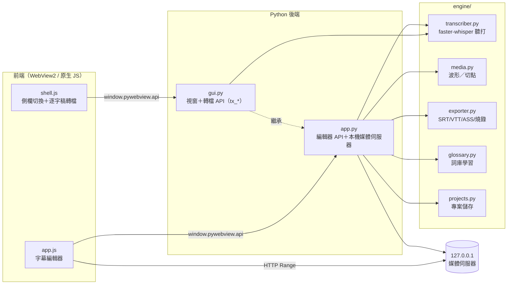
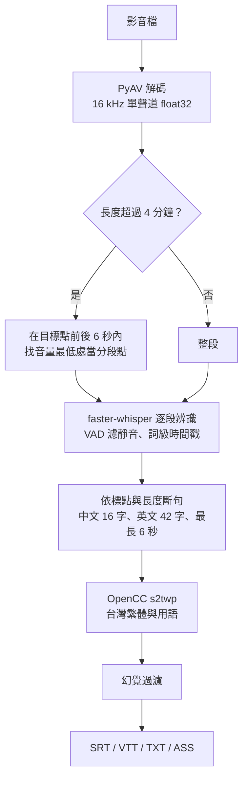

# AutoSubtitle 字幕工房

**繁體中文** | [English](README.en.md)

在自己的電腦上完成「聽打、斷句、對時間、上樣式、匯出」的自動上字幕工具。
語音辨識完全離線執行，影片不上傳任何雲端，也不需要登入。


## 特色

- **單一視窗**：左側切換「逐字稿轉檔」與「字幕編輯器」，所有功能都在同一個視窗裡，不另開視窗。
- **圓潤簡潔的介面**：藥丸形按鈕、圓角卡片、分段控制與開關，跟著系統自動切換淺色／深色模式。
- **本機離線辨識**：使用 faster-whisper（CTranslate2 加速的 Whisper），支援 99 種語言自動偵測。
- **長影片也跑得動**：自動在安靜處分段辨識，記憶體用量固定；記憶體不足時自動降級模型，不會整個失敗。
- **台灣用語**：OpenCC `s2twp` 把簡體轉成台灣繁體與慣用語。
- **越用越準的詞庫**：修正字幕後自動找出改了什麼，一鍵加入詞庫，下次辨識優先採用。
- **完整編輯器**：波形拖曳調時間、切點磁吸、影片即時預覽、字幕樣式、逐字亮起（卡拉 OK）、安全框。
- **多種匯出**：SRT、VTT、TXT、帶樣式的 ASS，有 ffmpeg 時可直接燒錄成品影片。

## 畫面

| 逐字稿轉檔（淺色） | 逐字稿轉檔（深色） |
|---|---|
|  |  |
| **轉檔完成（淺色）** | **專案列表（深色）** |
|  |  |
| **字幕編輯器（淺色）** | **字幕編輯器（深色）** |
|  |  |

以上截圖都來自實際執行的程式，轉檔結果是用 `base` 模型對內附測試影片真正辨識出來的。

## 安裝與啟動

需求：Python 3.10 以上。Windows 需要 WebView2 執行階段（Windows 10/11 通常已內建），macOS 與 Linux 也可執行。

```bash
git clone https://github.com/alextixu/AutoSubtitle.git
cd AutoSubtitle
pip install -r requirements.txt
python gui.py
```

Windows 也可以直接雙擊 `AutoSubtitle.bat`，不會出現主控台視窗。

| 指令 | 說明 |
|---|---|
| `python gui.py` | 開主視窗，預設停在逐字稿轉檔 |
| `python gui.py transcribe` | 開啟後停在逐字稿轉檔 |
| `python gui.py editor` | 開啟後停在字幕編輯器（等同 `python app.py`） |
| `python app.py --check` | 冒煙測試，不開視窗 |

第一次使用某個模型時會自動下載模型檔（`small` 約 484 MB），之後即可離線使用。

## 使用方式

### 逐字稿轉檔

1. 按「選擇影音檔」，支援 mp4、mov、mkv、webm、avi、mp3、wav、m4a、aac、flac。
2. 長影片可以在「只轉其中一段」填起訖時間，例如 `13:00`、`1:02:03` 或 `780`。留空就是整支。
3. 選模型、語言、裝置，需要的話加上詞庫檔（純文字，一行一個專有名詞）。
4. 按「開始轉檔」。可以隨時取消，完成後在同一頁預覽逐字稿、一鍵複製全文或開啟輸出資料夾。

每次會產出三個檔案：

| 檔案 | 用途 |
|---|---|
| `<名稱>_逐字稿.txt` | 純文字，適合閱讀或貼進文件 |
| `<名稱>_逐字稿_含時間.txt` | 每行前面加 `[mm:ss]`，方便回頭找片段 |
| `<名稱>.srt` | 字幕檔，可匯入剪輯軟體 |

只轉一段時，輸出的時間戳仍是原影片時間，檔名會加上範圍（例如 `_1300-end`），不會蓋掉整支的結果。

### 字幕編輯器

1. 輸入專案名稱、選擇影音檔、按「建立專案」。
2. 按「開始辨識」產生字幕，之後逐句修改。
3. 調整樣式、拖曳字幕位置，最後按「匯出」。

| 操作 | 效果 |
|---|---|
| 雙擊字幕 | 編輯文字 |
| `Enter` | 在游標處斷句 |
| 行首 `Backspace` | 與上一句合併 |
| `Tab` | 存檔並跳到下一句 |
| `Esc` | 取消編輯 |
| `Space` | 播放／暫停 |
| `B` | 在播放位置切開字幕 |
| 波形區滑鼠掃過 | 即時試聽 |
| 拖曳波形上的字幕框 | 調整起訖時間，會磁吸到切點與其他字幕邊界 |
| 波形空白處拖曳 | 新增字幕 |
| 波形雙擊 | 放置／移除 Mark 點 |

### 指令列

```bash
# 逐字稿：一次產出純文字、含時間、SRT
python transcribe.py 錄音.m4a
python transcribe.py 會議錄影.mp4 --start 13:00              # 從 13 分鐘開始
python transcribe.py 會議錄影.mp4 --start 5:30 --end 20:00   # 只轉其中一段
python transcribe.py 錄音.m4a --model medium --glossary 詞庫.txt

# 字幕工具：可選格式、燒錄影片
python subtitle_tool.py 影片.mp4 --formats srt,vtt,ass,txt --timestamps
python subtitle_tool.py 影片.mp4 --burn
```

## 技術原理

### 整體架構



- **桌面外殼**：用 pywebview 開一個系統原生 WebView（Windows 是 WebView2），介面是純 HTML、CSS、JavaScript，不用任何前端框架。
- **前後端溝通**：pywebview 把 Python 物件的公開方法注入成 `window.pywebview.api.*`，JavaScript 呼叫後拿到 Promise。`gui.Api` 繼承 `app.Api`，同一個物件同時提供轉檔與編輯器兩組 API。
- **長時間工作**：辨識在背景執行緒跑，前端每 250 毫秒輪詢一次狀態，所以介面不會卡住。取消時由進度回呼拋出例外，中斷辨識迴圈。
- **影片播放**：WebView 不能直接讀任意本機路徑，所以後端在 `127.0.0.1` 的隨機埠開一個小型 HTTP 伺服器。它只服務已登記的檔案（用隨機 token 當網址），並支援 `Range` 請求，影片可以任意拖曳進度。

### 辨識流程



1. **解碼**：用 PyAV 只讀音訊軌，重新取樣成 Whisper 需要的 16 kHz 單聲道。只轉一段時會先 seek 到起點附近的封包，不必從頭讀整個檔案，再依第一個音框的時間精準裁切。
2. **分段**：一小時的影片如果整段丟進去，faster-whisper 需要一大塊連續記憶體做頻譜轉換，很容易失敗。所以超過 4 分鐘就每 4 分鐘切一段，切點選在前後 6 秒內音量最低的 0.1 秒，避免把一句話切成兩半。
3. **辨識**：faster-whisper 是用 CTranslate2 重新實作的 Whisper，CPU 上用 int8 量化，速度比原版快數倍、記憶體更省。開啟 VAD（語音活動偵測）跳過靜音，並要求詞級時間戳。
4. **上下文與詞庫**：每段辨識時，把詞庫內容加上前一段最後約 120 字放進 `initial_prompt`。Whisper 會延續這些寫法，所以專有名詞更準，跨段語意也更連貫。
5. **斷句**：用詞級時間戳把一段話切成適合字幕的短句。優先在標點後切；中文超過 16 字、英文超過 42 字、或單句超過 6 秒就強制切開。
6. **台灣用語**：偵測到中文時用 OpenCC `s2twp` 設定轉換，不只簡轉繁，也會換成台灣慣用詞。
7. **幻覺過濾**：Whisper 在靜音處偶爾會憑空生出句子。程式會刪掉長度幾乎為零、語速快到不可能（中文每秒超過 12 字），以及和前一句一字不差的字幕。

### 記憶體保護

Windows 上模型載入失敗（`mkl_malloc: failed to allocate memory`）通常不是實體記憶體不夠，而是「認可額度」（實體記憶體＋分頁檔）用完。程式內建三層保護：

1. **關掉 MKL 記憶體池**：設定 `MKL_DISABLE_FAST_MM=1`，避免 MKL 一開始就要一大塊記憶體。
2. **限制執行緒**：預設 4 條推論執行緒；載入失敗時退到 2 條、再退到 1 條，因為工作緩衝區是按執行緒數配置的。
3. **模型降級階梯**：`large-v3 → medium → small → base → tiny`。載入或推論任一階段撞到記憶體不足，就退一級重跑，並在結果中標明實際使用的模型。

如果還是跑不動，最有效的做法是把分頁檔調大。Microsoft 建議手動設定分頁檔大小，起始值為實體記憶體的 1.5 倍（見 [Microsoft Learn](https://learn.microsoft.com/en-us/troubleshoot/windows-client/performance/slow-page-file-growth-memory-allocation-errors)）。

查看目前剩餘的認可額度：

```powershell
$os = Get-CimInstance Win32_OperatingSystem; "剩餘認可額度: {0:N1} GB" -f ($os.FreeVirtualMemory/1MB)
```

### 編輯器的其他技術

- **波形**：PyAV 解碼後，每 1/50 秒取一組最小值與最大值，前端用 canvas 畫出來。結果會快取在專案資料夾。
- **切點偵測**：每秒取樣 8 幀，縮成 64×36 灰階，計算相鄰兩幀的平均像素差，超過門檻就記為剪輯點。拖曳字幕邊界時會磁吸到這些點，不需要 ffmpeg 執行檔。
- **詞庫學習**：用 `difflib.SequenceMatcher` 比對修改前後的文字，找出被替換或插入的片段，再往左右擴展到詞的邊界，例如把「斷具」改成「斷句」時會提示加入「斷句」。
- **逐字亮起**：匯出 ASS 時，把每個詞的時間長度換算成 `\k` 標籤（單位 1/100 秒），播放器就會逐字變色。
- **燒錄**：偵測到 ffmpeg 時，先產生帶樣式的 ASS，再用 ffmpeg 的 ass 濾鏡把字幕燒進影片。

## 專案結構

```
gui.py               主視窗（pywebview）＋逐字稿轉檔 API
app.py               字幕編輯器 API＋127.0.0.1 媒體伺服器
transcribe.py        指令版逐字稿（gui.py 共用它的檔名與輸出格式）
subtitle_tool.py     指令版字幕工具（多格式、燒錄）
AutoSubtitle.bat     Windows 雙擊啟動
engine/
  transcriber.py     解碼、分段、faster-whisper 辨識、斷句、幻覺過濾
  media.py           波形峰值、剪輯切點偵測（PyAV）
  exporter.py        SRT／VTT／TXT／ASS 匯出、ffmpeg 燒錄
  glossary.py        詞庫與自動學習
  projects.py        本機專案儲存（projects/<名稱>/project.json）
ui/
  index.html         單一視窗外殼
  shell.js           側欄切換、逐字稿轉檔
  app.js             字幕編輯器
  style.css          設計 token（淺色／深色）
docs/images/         README 截圖
make_test_video.py   產生測試影片（每 4 秒換畫面，用來驗證切點偵測）
test_video.mp4       測試影片
test_audio.wav       測試音訊
```

## 開發

- 用 HTTP 伺服器開介面時沒有 pywebview，前端會自動改用模擬資料，方便只調整版面：

  ```bash
  python -m http.server 8765
  ```

  然後開啟 `http://localhost:8765/ui/index.html`。
- 加上 `--debug` 啟動可以開啟 WebView 開發者工具：`python gui.py --debug`。

## 需求

- Python 3.10 以上
- Windows 10/11（WebView2）、macOS 或 Linux
- 燒錄成品影片才需要 ffmpeg，Windows 可用 `winget install Gyan.FFmpeg` 安裝
- 使用 CUDA 需要 NVIDIA 顯示卡與對應的 cuBLAS／cuDNN

## 授權

[MIT License](LICENSE)

本專案使用的開源元件：[faster-whisper](https://github.com/SYSTRAN/faster-whisper)、[CTranslate2](https://github.com/OpenNMT/CTranslate2)、[PyAV](https://github.com/PyAV-Org/PyAV)、[OpenCC](https://github.com/yichen0831/opencc-python)、[pywebview](https://github.com/r0x0r/pywebview)、[NumPy](https://numpy.org/)。
